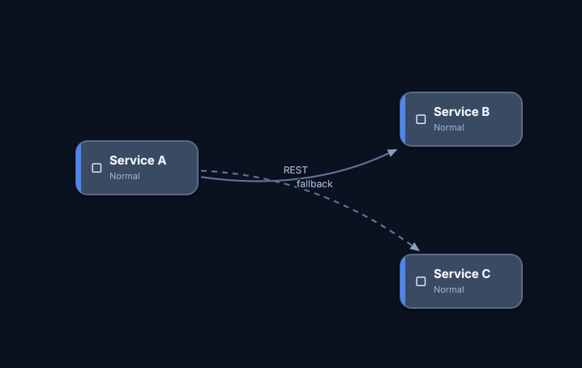
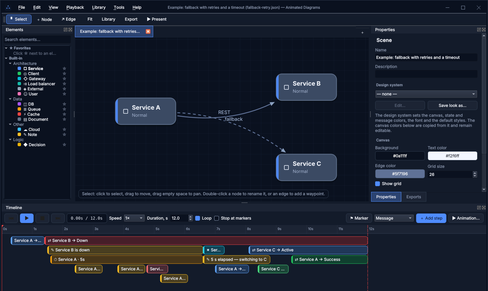

<p align="center">
  
</p>

<h1 align="center">Animated Diagrams</h1>

<p align="center">
  <b>Draw an architecture diagram, animate how requests flow through it, show it anywhere:</b><br>
  GIF · WebM · MP4 · PowerPoint · interactive HTML player
</p>

<p align="center">
  <a href="https://github.com/coderatny/animateddiagrams/actions/workflows/ci.yml"></a>
  <a href="LICENSE"></a>
  
  
  
</p>

<p align="center"><b>English</b> · <a href="README.ru.md">Русский</a></p>

<p align="center">
  
</p>

The animation above is the built-in sample, exported to a 310 KB GIF from the editor.
Service A retries a request to the failed Service B, a 5-second timer runs out, and the traffic switches
to Service C.

## ✨ Features

**🎬 Animate request flows**
- Steps on a timeline: messages along edges (packets, curves, trails), state changes (down, active, success),
  timers and timeouts, notes, actions, edge animations and key-frame effects.
- Templates with roles: retries, timeout + fallback, pub/sub, cache-aside and more. Pick the nodes and
  the steps are generated.
- Every frame is a pure function of `(document, time)`. Scrubbing, playback speed and export all show
  exactly what the editor shows.

**📤 Export anywhere**
- **GIF** with one palette for the whole animation, **WebM** (VP9 / AV1) and **MP4** (H.264). Encoding
  runs in-process through the FFmpeg libraries; no external `ffmpeg` is needed.
- **PowerPoint (.pptx)**, four kinds of slides:
  - video that plays automatically;
  - animated GIF, which also works in Google Slides;
  - **native editable shapes with PowerPoint animations**;
  - key frames with the **Morph** transition.
  
  Slides can also be added to an existing presentation.
- **Interactive HTML player**: one self-contained page (the engine compiled to WebAssembly) for
  reveal.js, Slidev, Marp or an `<iframe>`.
- PNG frame sequences. Every export runs in the background while you keep editing.

**🎤 Present**
- Markers split the scenario into chapters. Presenter mode (`F5`) plays chapter by chapter on a click.
- Each chapter becomes its own click-to-continue slide in PowerPoint.

**🎨 Make it yours**
- Design systems: color tokens, state and message colors, fonts and default styles. One choice
  restyles the whole diagram and the editor's own interface.
- A library of element types (shape, colors, stroke, font, custom SVG outline), effects (scale,
  rotation, offset, opacity, glow, tint) and animation templates.
- **Plugins**: JSON packs of elements, effects, animations and design systems, created right from the
  editor. Three are bundled: Cloud kit, Data platform (PostgreSQL, ClickHouse, Kafka, CDC) and Security
  kit (OAuth, JWT, WAF).

**🤖 AI-ready**
- A built-in **MCP server** (stdio and HTTP) lets an agent build, check and export diagrams. A ready-made
  [skill for agents](skills/animated-diagrams/SKILL.md) is included.

**🧰 Everyday comfort**
- Several documents in tabs, with the last session restored.
- Dockable panels, a palette with favorites, undo/redo.
- **draw.io import**: compressed and multi-page files.
- English and Russian interface; plugins can carry their own translations.
- A title bar styled like the app, and crash reports with stack traces.

<p align="center">
  
</p>

## 📦 Install

Download a package from **[Releases](https://github.com/coderatny/animateddiagrams/releases)** (built for
every `vX.Y.Z` tag), or from the artifacts of the latest CI run.

| Platform | Package |
|---|---|
| **Windows 10/11 (x64)** | `animated-diagrams-X.Y.Z-win64.exe`, the installer, or `…-win64.zip`, the portable version |
| **Ubuntu 24.04 / Debian 13** | `sudo apt install ./animated-diagrams_*_amd64.deb` |
| **Fedora** | `sudo dnf install ./animated-diagrams-*.x86_64.rpm` |

**Windows installer.** A new version installs over the old one and updates it in place:
- the same folder and shortcuts, and a single entry in *Apps & features*;
- the running app is closed first;
- settings and user plugins are kept;
- installing an older version over a newer one asks for confirmation first.

The installer is in English or Russian. Silent install for admins:
`animated-diagrams-X.Y.Z-win64.exe /VERYSILENT /SUPPRESSMSGBOXES`.

## 🚀 Quick start

Open the editor, press `N` to add nodes and `E` to connect them, then press **Add step** on the timeline.
You can also start from **File → Open Example**. The command line works without a window:

```bash
animated-diagrams diagram.json                              # open (a .drawio file is imported)
animated-diagrams --export flow.gif diagram.json            # export, no display needed
animated-diagrams --export flow.mp4 --fps 30 --scale 2 diagram.json
animated-diagrams --export deck.pptx --pptx-mode animated diagram.json   # editable PowerPoint slides
animated-diagrams --export deck.pptx --pptx-insert talk.pptx --pptx-after 3 diagram.json
animated-diagrams --export slides/flow.html diagram.json    # HTML player for web slides
animated-diagrams --convert out.json scheme.drawio --page 1 # draw.io → native document
animated-diagrams --mcp diagram.json                        # MCP server over stdio
animated-diagrams --mcp-port 8765 diagram.json              # GUI + MCP over HTTP
```

The format comes from the extension, or from `--format gif|png|webm|mp4|pptx|html`. Other options:
`--fps`, `--scale`, `--background`, `--no-loop`, `--no-autoplay`, `--pptx-mode video|gif|animated|morph`,
`--slide-size 16:9|4:3`, `--no-segments` and `--lang en|ru`.

<details>
<summary><b>Editor cheat sheet</b></summary>

| Action | How |
|---|---|
| Tools | `V` select · `N` node (pick a type in the palette or drag it onto the canvas) · `E` edge |
| Tabs | `Ctrl+N` new · `Ctrl+O` open · `Ctrl+W` close · `Ctrl+PgUp/PgDn` switch; drop files onto the canvas |
| Move / pan / zoom | drag · drag empty space or the middle button · wheel |
| Edge waypoints | double-click an edge to add one, a waypoint to remove it, drag to move |
| Playback | `Space` · `Home` / `End` · click the timeline ruler · *Stop at markers* |
| Timeline | drag steps, drag their edges to change the duration, `Ctrl` + wheel zooms |
| Markers (chapters) | `M` at the playhead; right-click the ruler to add / rename / delete; drag to move |
| Presenter mode | `F5`: full-screen canvas; `Space` / `→` / click plays to the next marker, `←` goes back, `Esc` exits |
| Library | `Ctrl+L`: elements, effects, animations and design systems; export them to a plugin |
| Animation template | `Ctrl+T`: map the template roles to nodes |
| draw.io import | `Ctrl+I` |
| Export | `Ctrl+E`: GIF / PNG / WebM / MP4 / PowerPoint / HTML, in the background |
| Edit | `Ctrl+Z` / `Ctrl+Shift+Z` · `Del` · `Ctrl+D` duplicates a step |
| Language | *View → Language* (English / Russian), `--lang`; applied after a restart |

Crash reports are saved to `<app data>/crashes`: the reason, the stack and the last events, plus a
minidump on Windows. *Help → Crash Reports…* opens the folder.
</details>

## 📚 Documentation

The detailed guides are in Russian for now.

- [Presentations](docs/presentations.md): PowerPoint modes, inserting into a deck, the HTML player
- [Document format](docs/file-format.md) · [Design systems](docs/design-systems.md) · [Plugins](docs/plugins.md)
- [MCP server](docs/mcp.md) · [Skill for agents](skills/animated-diagrams/SKILL.md). For Claude Code:
  `cp -r skills/animated-diagrams ~/.claude/skills/`
- [Localization](docs/localization.md): adding a language, translations in plugins

## 🛠 Build from source

Ubuntu 24.04:

```bash
sudo apt install cmake ninja-build pkg-config clang-19 qt6-base-dev qt6-tools-dev qt6-l10n-tools libgl-dev \
                 libgtest-dev nlohmann-json3-dev libpugixml-dev libnanosvg-dev zlib1g-dev libzip-dev \
                 libavcodec-dev libavformat-dev libavfilter-dev libswscale-dev
cmake --workflow --preset release          # configure + build + test → build/release
./build/release/apps/animated-diagrams
```

The presets are `debug` (with `-Werror`), `release` and `asan` (the core and its tests under ASan/UBSan).
Packages are built with `cpack -G DEB`, `RPM` or `"INNOSETUP;ZIP"`. The last one needs CMake 3.27+ and
Inno Setup 6.

- **Options**: `BUILD_APP`, `BUILD_TESTS`, `WARNINGS_AS_ERRORS`, `WITH_LIBAV` (OFF leaves only PNG frames and
  the editable PowerPoint modes) and `AD_PLAYER_HTML` (a prebuilt `player.html`; without it there is no HTML
  export).
- **Libraries**: formats are handled by established libraries, not by our own code. XML uses pugixml,
  DEFLATE uses zlib, SVG paths use nanosvg, GIF and video use libav, and the PowerPoint container uses libzip.
- **Fedora**: install `json-devel gtest-devel pugixml-devel libzip-devel nanosvg-devel zlib-ng-compat-devel`
  and `libav*-free-devel`.
- **Windows**: the libraries come from `vcpkg.json` (`-DCMAKE_TOOLCHAIN_FILE=$VCPKG_ROOT/scripts/buildsystems/vcpkg.cmake`),
  and FFmpeg comes from a shared SDK (`-DFFMPEG_ROOT=…`).
- **HTML player**: it is built separately with Emscripten:

  ```bash
  emcmake cmake -S . -B build/player -G Ninja && cmake --build build/player
  cmake -S . -B build/release … -DAD_PLAYER_HTML=$PWD/build/player/player/player.html
  ```

## 🏗 Architecture

```
src/      ad_core: all the logic without Qt, covered by unit tests
            ad_engine: model, JSON, geometry, engine, timeline (STL + nlohmann_json + nanosvg;
                       it also compiles to WebAssembly)
            Import/  draw.io      Export/  GIF / video (libav), PowerPoint (libzip + pugixml), HTML player
            Mcp/     MCP server   Plugins/ plugin format and manager
UI/       Qt Widgets: tabs, docks, canvas, timeline, inspector, library, background export
apps/     entry point: GUI / CLI / MCP
player/   HTML player: ad_engine → WebAssembly + a <canvas> renderer of the display list
tests/    GoogleTest + export smoke tests (GIF / PNG / WebM / MP4 / PowerPoint / HTML) + MCP sessions
```

## 🔄 CI/CD

Every push is built and tested on:
- Ubuntu 24.04 (clang-19 and gcc-13), Debian 13 and Fedora 43;
- ASan + UBSan;
- clang-format and clang-tidy;
- Windows (MSVC 2022, Qt 6.8, vcpkg). It also builds the installer and checks a real update: install an old
  build, update it while it runs, refuse a downgrade, uninstall.

A `vX.Y.Z` tag publishes a GitHub Release with all packages and `SHA256SUMS.txt`:

```bash
git tag v2.1.0 && git push origin v2.1.0     # v2.1.0-rc1 is a pre-release
```

## 📄 License

[MIT](LICENSE). Third-party components are listed in [THIRD_PARTY_NOTICES.md](THIRD_PARTY_NOTICES.md).
